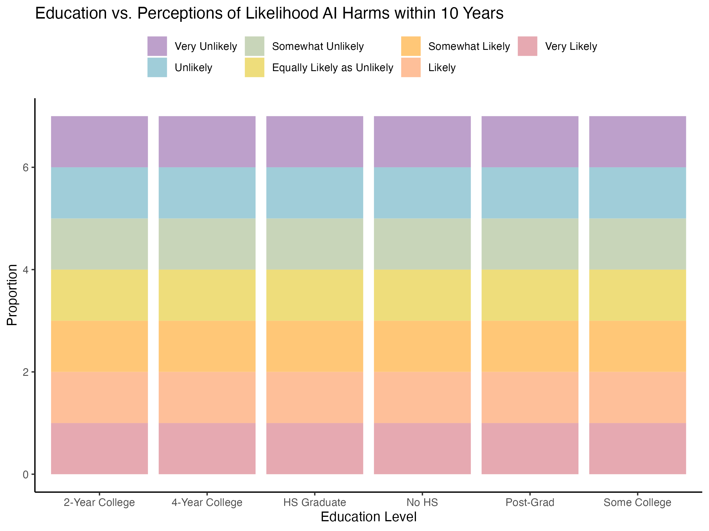
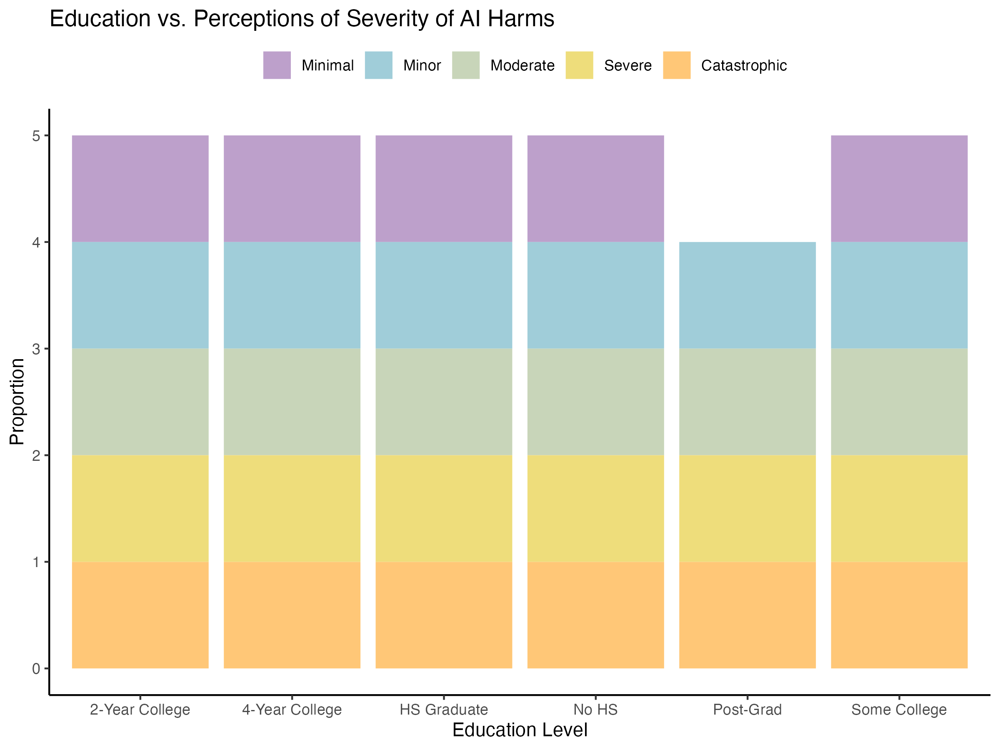
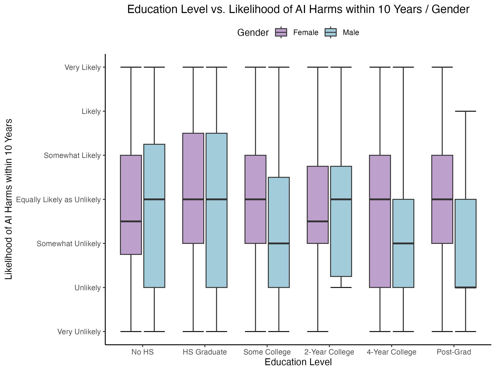
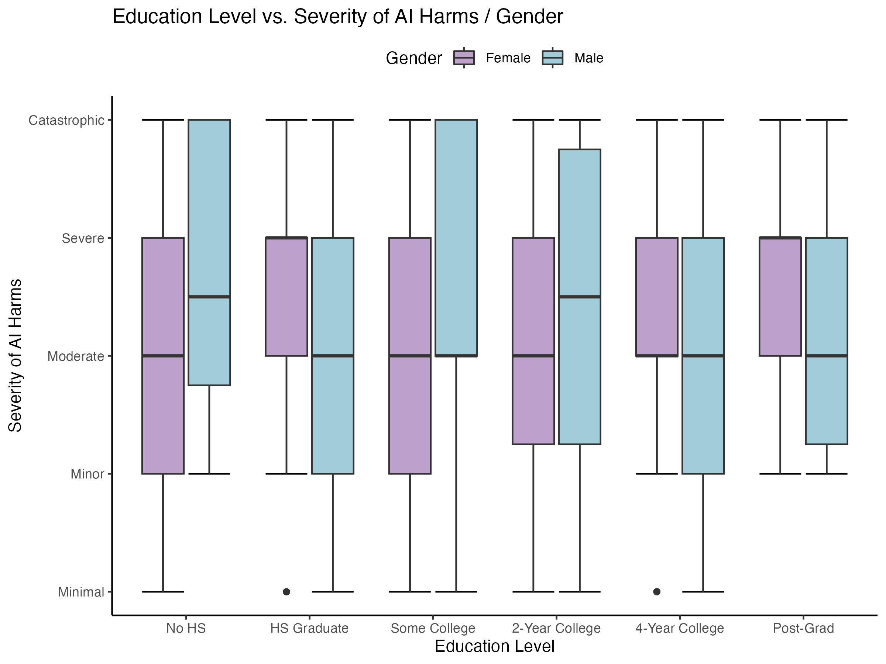

class: titleSlide, hide_logo

```{r setup, include=FALSE}
library(tidyverse)
library(xaringan)
library(xaringanExtra)
library(xaringanthemer)
library(here)
library(sysfonts)
library(showtext)
library(countdown)
library(lubridate)
library(zoo)
library(viridis)
library(palmerpenguins)
library(ggdist)
library(patchwork)

options(htmltools.dir.version = FALSE)
knitr::opts_chunk$set(
  fig.width=9, fig.height=3.5, fig.retina=3,
  out.width = "100%",
  cache = FALSE,
  echo = TRUE,
  message = FALSE, 
  warning = FALSE,
  hiline = TRUE
)
```

```{r xaringan-panelset, echo=FALSE}
xaringanExtra::use_panelset()
```

```{r xaringan-editable, echo=FALSE}
xaringanExtra::use_editable(expires = 1)
```

```{r xaringan-extra-styles, echo=FALSE}
xaringanExtra::use_extra_styles(
  hover_code_line = TRUE,         #<<
  mute_unhighlighted_code = TRUE  #<<
)
```

```{r xaringanExtra-clipboard, echo=FALSE}
xaringanExtra::use_clipboard()
```

```{r share-again, echo=FALSE}
xaringanExtra::use_share_again()
xaringanExtra::style_share_again(share_buttons="none")
```

```{r xaringan-themer, include=FALSE, warning=FALSE, eval=T}
style_duo_accent(
  primary_color = "white",
  secondary_color = "Dark Blue",
  header_font_google = google_font("Source Sans Pro"),
  text_font_google   = google_font("Libre Franklin", "300", "300i"),
  code_font_google   = google_font("Anonymous Pro"),
  base_font_size = "30px",
  text_font_size = "1rem",
  header_h1_font_size = "2.5rem",
  header_h2_font_size = "2rem",
  header_h3_font_size = "1.25rem",
  padding = "8px 32px 8px 32px",
)

font_add_google("Poppins", "Poppins")
font_add_google("Libre Franklin", "Frank")
showtext_auto()
```

```{r xaringan-logo, echo=FALSE, eval=FALSE}
xaringanExtra::use_logo(
  image_url = "logo.png"
)
```

## Topic Overview

Public opinion towards artificial intelligence (AI) has great potential to influence future legislation and negotiate how AI will be integrated into key areas of life.

Source Data set:

Zhang, Baobao and Allan Dafoe. "Artificial Intelligence: American Attitudes and Trends." Oxford, UK: Center for the Governance of AI, Future of Humanity Institute, University of Oxford, 2019.


The variables we used from the data set were:

1. Q1_9 -  Likelihood of event globally in next 10 years - Harmful consequences of artificial intelligence

2. Q2_9 - Size of negative impact if event occurred - Harmful consequences of artificial intelligence

3. educ - education level 

4. gender - gender

---

## Our Approach 

We aim to map our the relationship between education level and their attitudes towards AI. We are going off the assumption that education is a proxy for awareness- and so how does awareness influence people's perceptions of AI. 

From there we want to map gender onto the existing relationship to examine the differences between male and female attitudes towards artificial intelligence. So how do male and female respondents differentiate in their perceptions of AI along similar educational backgrounds? 

```{r echo = FALSE}
library(tidyverse)
library(tidytuesdayR) 
library(haven) 
library(dataReporter)
library(ggplot2)
library(dplyr)
library(gtsummary)
library(gt)
library(RSQLite)
```

```{r echo = FALSE}
df0 <- readRDS("YALE0065_OUTPUT.rds")
df1 <- subset(df0, select = c(educ, gender, Q1_9, Q2_9  ) ) %>% 
  na.omit()
```
---
## Data Cleaning and Wrangling

Remove observations that are: "I don't know", "skipped", or "not asked"

```{r}

df1<- df1 %>% filter(Q1_9 < 98) %>% 
  filter(Q2_9 < 6) %>% 
  filter(educ < 7)

```

We also made our demographic variables into numeric class as it was previously 'labelled' class due to the haven package.

```{r}
df1$gender <- as.numeric(df1$gender)
df1$educ <- as.numeric(df1$educ)
df1$Q1_9 <- as.numeric(df1$Q1_9)
df1$Q2_9 <- as.numeric(df1$Q2_9)

```

---

## Data Wrangling - Recode variables

Gender

```{r}
df1 <- df1 %>% 
  mutate(gender = case_when(
    gender == 1 ~ "Male",
    gender == 2 ~ "Female",
    TRUE ~ as.character(gender)  # Keep other values unchanged
  ))
```

 Q1_9 Responses - Likely of global event (related to AI) to happen in 10 years

```{r}
df1 <- df1 %>% 
  mutate(Q1_9 = case_when(
    Q1_9 == 1 ~ "Very Unlikely",
    Q1_9 == 2 ~ "Unlikely",
    Q1_9 == 3 ~ "Somewhat Unlikely",
    Q1_9 == 4 ~ "Equally Likely as Unlikely",
    Q1_9 == 5 ~ "Somewhat Likely",
    Q1_9 == 6 ~ "Likely",
    Q1_9 == 7 ~ "Very Likely"
  ))
```
---

## Recode variables cont. 

Q2_9 Responses - Size of negative impact of AI

```{r}
df1 <- df1 %>% 
  mutate(Q2_9 = case_when(
    Q2_9 == 1 ~ "Minimal",
    Q2_9 == 2 ~ "Minor",
    Q2_9 == 3 ~ "Moderate",
    Q2_9 == 4 ~ "Severe",
    Q2_9 == 5 ~ "Catastrophic"
  ))
```

Education

```{r}
df1 <- df1 %>% 
  mutate(educ = case_when(
    educ == 1 ~ "No HS",
    educ == 2 ~ "HS Graduate",
    educ == 3 ~ "Some College",
    educ == 4 ~ "2-Year College",
    educ == 5 ~ "4-Year College",
    educ == 6 ~ "Post-Grad"
  ))
```

---

### We then created new variables with numeric values for the box plot

```{r}
#Create new variables:
df1$Q1numeric <- df1$Q1_9 
df1$Q2numeric <- df1$Q2_9 

# Recode new variable Q1numeric into this scale
df1 <- df1 %>% 
  mutate(Q1numeric = case_when(
    Q1numeric == "Very Unlikely" ~ -3,
    Q1numeric == "Unlikely" ~ -2,
    Q1numeric == "Somewhat Unlikely" ~ -1,
    Q1numeric == "Equally Likely as Unlikely" ~ 0,
    Q1numeric == "Somewhat Likely" ~ 1,
    Q1numeric == "Likely" ~ 2,
    Q1numeric == "Very Likely" ~ 3
  ))

# Recode new variable Q2numeric into this scale
df1 <- df1 %>% 
  mutate(Q2numeric = case_when(
    Q2numeric == "Minimal" ~ -2,
    Q2numeric == "Minor" ~ -1,
    Q2numeric == "Moderate" ~ 0,
    Q2numeric == "Severe" ~ 1,
    Q2numeric == "Catastrophic" ~ 2
  ))

#Making sure the new variables are numeric

df1$Q1numeric <- as.numeric(df1$Q1numeric)
df1$Q2numeric <- as.numeric(df1$Q2numeric)

```

---

## Created new dataframes and variables to measure proportion of responses at each education level for the stacked bar plot

```{r}
Q1Prop <- df1 %>%
  group_by(educ, Q1_9) %>%
  summarise(count = n(), .groups = "keep") %>%
  mutate(prop = count / sum(count))

Q2Prop <- df1 %>%
  group_by(educ, Q2_9) %>%
  summarise(count = n(), .groups = "keep") %>%
  mutate(prop = count / sum(count)) 
```

```{r echo = FALSE}
theme_set(
  theme_classic() +
    theme(legend.position = "top")
  )
#We opted for the classic theme to keep our visualization simple. We preferred to specify the colors used in the plots instead of a pre-set theme.
```


---
class: left, hide-count

### Plot 1: Relationship between Education Level and Perceptions on likelihood of AI harms within the next 10 years.

.panelset[

.panel[.panel-name[Code]

```{r}

Q1Prop<- Q1Prop %>% 
   mutate(educ = fct_relevel(educ, 
            "No HS","HS Graduate","Some College","2-Year College","4-Year College", "Post-Grad")) 


Q1Prop$Q1_9 <- factor(Q1Prop$Q1_9, levels = c("Very Unlikely", "Unlikely", "Somewhat Unlikely", "Equally Likely as Unlikely", "Somewhat Likely", "Likely", "Very Likely"))

plot1 <-ggplot(Q1Prop, aes(x = educ, y = prop, fill = factor(Q1_9))) +
  geom_bar(stat = "identity", position = "stack") +
  scale_fill_manual(values = c("Very Unlikely" = "#BDA0CB", "Unlikely" = "#A0CDD9",
                                "Somewhat Unlikely" = "#C8D5B9", "Equally Likely as Unlikely" = "#EEDD7B", "Somewhat Likely"="#FFC777", "Likely"= "#FEBF99", "Very Likely"="#E6A9B1", "NA" = "grey68")) +
  labs(title = "Education vs. Perceptions of Likelihood AI Harms within 10 Years",
       x = "Education Level",
       y = "Proportion", 
        fill= "")
```
]

.panel[.panel-name[Plot]

<center>

</center>

]

]

---

class: left, hide-count

### Plot 2: The Relationship between Education Level and Perceptions on Severity of AI Harms.

.panelset[

.panel[.panel-name[Code]

```{r}
   
Q2Prop<- Q2Prop %>% 
   mutate(educ = as_factor(educ) %>%
           fct_relevel("No HS", "HS Graduate", "Some College", "2-Year College", "4-Year College", "Post-Grad"))

Q2Prop$Q2_9 <- factor(Q2Prop$Q2_9, levels = c("Minimal", "Minor", "Moderate", "Severe", "Catastrophic"))

plot2 <- ggplot(Q2Prop, aes(x = educ, y = prop, fill = factor(Q2_9))) +
  geom_bar(stat = "identity", position = "stack") +
 scale_fill_manual(values = c("Minimal" = "#BDA0CB", "Minor" = "#A0CDD9",
                                "Moderate" = "#C8D5B9", "Severe" = "#EEDD7B", "Catastrophic"="#FFC777"))+
  labs(title = "Education vs. Perceptions of Severity of AI Harms",
       x = "Education Level",
       y = "Proportion", 
       fill= "")
```
]

.panel[.panel-name[Plot]

<center>

</center>

]

]

---

## Observations

1. Likelihood of AI Harms: As education level increases, respondents perceive lower risk of AI harms within 10 years. 

2. Severity of Harms: As education level increases, responses are less extreme about the severity of AI harms (i.e. minimal or catastrophic). Therefore, they are more moderate. 

---
class: left, hide-count

### Plot 3: The Relationship between Education Level and Likelihood of AI Harms mapped with Gender .

.panelset[

.panel[.panel-name[Code]

```{r}
df1 <- df1 %>% 
   mutate(educ = fct_relevel(educ, 
            "No HS","HS Graduate","Some College","2-Year College","4-Year College", "Post-Grad")) 

custom_y_labels <- c("Very Unlikely", "Unlikely", "Somewhat Unlikely", "Equally Likely as Unlikely", "Somewhat Likely", "Likely", "Very Likely")

box1 <- ggplot(df1, aes(x = educ, y = Q1numeric, fill = gender)) +
  stat_boxplot(geom = "errorbar")+
  geom_boxplot() +
  labs(title = "Education Level vs. Likelihood of AI Harms within 10 Years / Gender",
       x = "Education Level",
       y = "Likelihood of AI Harms within 10 Years",
       fill = "Gender")+
    scale_y_continuous(breaks = c(-3,-2,-1,0,1,2,3), labels = custom_y_labels)+
  scale_fill_manual(values = c("Female" = "#BDA0CB", "Male" = "#A0CDD9"))
```
]

.panel[.panel-name[Plot]

<center>

</center>

]

]
---
class: left, hide-count

### Plot 4: The Relationship between Education Level and Severity of AI Harms Mapped With Gender.

.panelset[

.panel[.panel-name[Code]


```{r}
custom_y_labels2 <- c("Minimal", "Minor", "Moderate", "Severe", "Catastrophic")

box2 <- ggplot(df1, aes(x = educ, y = Q2numeric, fill = gender)) +
  stat_boxplot(geom = "errorbar")+
  geom_boxplot() +
  labs(title = "Education Level vs. Severity of AI Harms / Gender",
       x = "Education Level",
       y = "Severity of AI Harms",
       fill = "Gender")+
   scale_y_continuous(breaks = c(-2,-1,0,1,2), labels = custom_y_labels2)+
  scale_fill_manual(values = c("Female" = "#BDA0CB", "Male" = "#A0CDD9"))
```
]

.panel[.panel-name[Plot]

<center>

</center>

]

]

--- 


---

### Observations

1. Likelihood of AI Harms/Gender: Female respondents have a tighter range of neutral-somewhat unlikely answers than male respondents, but both genders found the likelihood of AI harms to be more unlikely as education levels increased.

2. Severity of Harms/Gender: Male respondents favored a more severe disposition in lower education levels (no HS, HS, some college, two-year college), dropping to a more moderate disposition as education levels increased to 4-year college and post-grad. Conversely, female respondents remained consistently moderate despite education levels with a slight favor toward a  moderate-severe disposition as their education levels increased. 

---

### Limitations

1. Intended to measure age and race as variables too. Opted against age as the relationship to education felt more relevant to measure correlations for perceptions of AI. Opted against race as the sample was not equally representative from different racial groups. This made it hard to observe any clear relationships. 

2. We understand that our data was limited to the binary classifications of male and female, which may not be representative of respondents whose gender identity was not provided as an option.
